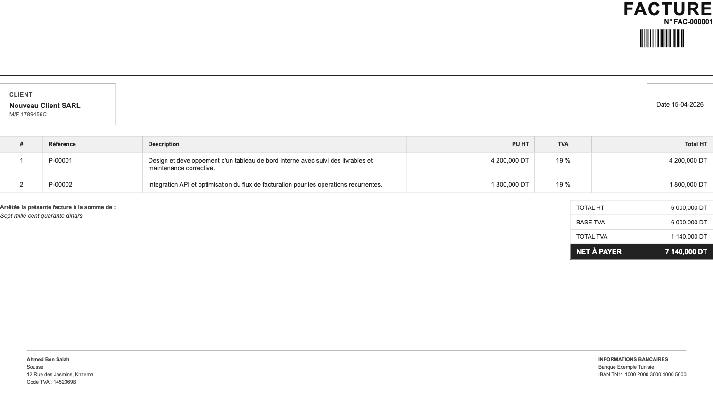

# fatoura-cli

Invoice generator for Tunisian freelancers, in the terminal or in a local web interface.

Create clean PDF invoices, reuse clients and services, and keep your data local.

> [!IMPORTANT]
> The repository and documentation are in English. The CLI prompts and generated invoices stay in French.



## What it does

- saves your profile once
- reuses saved clients
- reuses saved services
- auto-increments invoice numbers like `FAC-000001`
- auto-increments line references like `P-00001`
- generates PDF invoices with Tunisian number formatting like `13 750,000 DT`

## Scope

`fatoura-cli` is built for one use case: Tunisian freelancers who want a simple local invoicing tool.

| Constraint | Choice |
| --- | --- |
| Currency | Tunisian dinar (`DT`) |
| Language | French prompts and invoice labels |
| Tax fields | `Code TVA`, `M/F`, bank information |
| Output | One clean PDF invoice layout |

> [!NOTE]
> This is not a multi-country invoicing engine.

## Install

### System dependencies

<details>
<summary>macOS</summary>

The official WeasyPrint documentation recommends:

```bash
brew install weasyprint
```

</details>

<details>
<summary>Ubuntu 20.04+</summary>

The official WeasyPrint documentation recommends at least:

```bash
sudo apt install python3-pip libpango-1.0-0 libharfbuzz0b libpangoft2-1.0-0 libharfbuzz-subset0
```

</details>

### Package install

```bash
git clone https://github.com/HabibPro1999/fatoura-cli.git
cd fatoura-cli
python3 -m venv .venv
source .venv/bin/activate
pip install .
```

## Quick start

### 1. Save your profile

```bash
fatoura init
```

The command asks for:

- full name
- city
- address
- VAT code
- bank name
- IBAN
- PDF output directory

### 2. Create an invoice

```bash
fatoura create
```

### 3. List generated invoices

```bash
fatoura list
```

### Or use the web interface

```bash
fatoura web
```

Opens `http://127.0.0.1:8765` in your browser: create invoices, manage clients and services, edit your profile, and download PDFs. Same local data as the CLI.

## Example session

```text
$ fatoura create

Nouvelle facture

Client
  [1] ACME SARL (M/F 1234567A)
  [n] Nouveau client

Choix: 1

Date
Date de facture (JJ-MM-AAAA) [21-03-2026]:

Lignes
  [1] P-00001  Mobile application development  -  4 200,000 DT  (TVA 19%)
  [n] Nouveau service

Choix: 1
Ajouter une autre ligne ? [y/N]: n

Resume
  Facture : FAC-000012
  Client  : ACME SARL (M/F 1234567A)
  Date    : 21-03-2026

Generer le PDF ? [Y/n]: y
PDF genere: /Users/you/fatoura-invoices/FAC-000012.pdf
```

## Commands

| Command | Purpose |
| --- | --- |
| `fatoura init` | Save or update your business information |
| `fatoura create` | Create a new invoice interactively |
| `fatoura list` | Show local invoice history |
| `fatoura web` | Launch the local web interface (`--port`, default 8765) |

## Local data

> [!TIP]
> `fatoura-cli` is local-first. It does not send invoice data to any remote service.

By default, application data lives in:

```text
~/.fatoura-cli/
```

Generated PDFs go to:

```text
~/fatoura-invoices/
```

You can override the application data directory with:

```bash
export FATOURA_HOME=/your/custom/path
```

<details>
<summary>Stored files</summary>

- `data/config.json`
- `data/clients.json`
- `data/services.json`
- `data/counters.json`
- `data/history.json`

</details>

## Project files

| File | Purpose |
| --- | --- |
| `src/fatoura_cli/cli.py` | Main CLI logic |
| `src/fatoura_cli/web/` | Local web interface (Flask) |
| `src/fatoura_cli/template.html` | Invoice template used for PDF generation |
| `config.example.json` | Example config structure |
| `assets/mock-invoice.png` | Screenshot generated from fake data |
| `assets/mock-invoice.pdf` | Matching fake PDF preview |

## Privacy

- real user data lives outside the repository by default
- generated PDFs are ignored by git
- local config and history are ignored by git
- the repository contains mock assets only

## License

MIT
